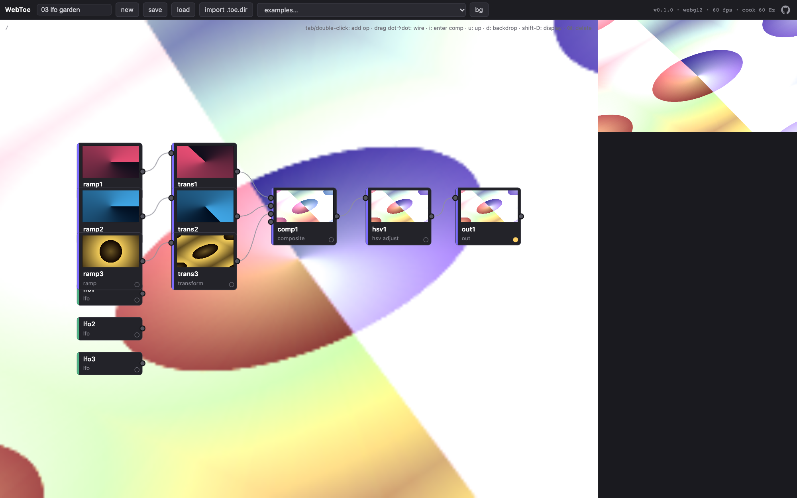
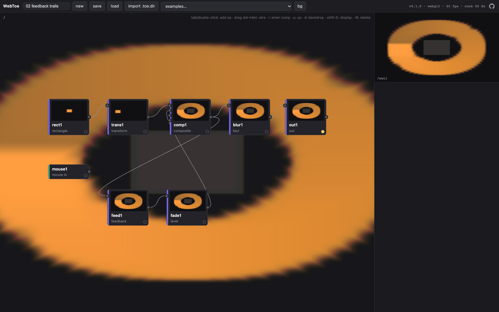
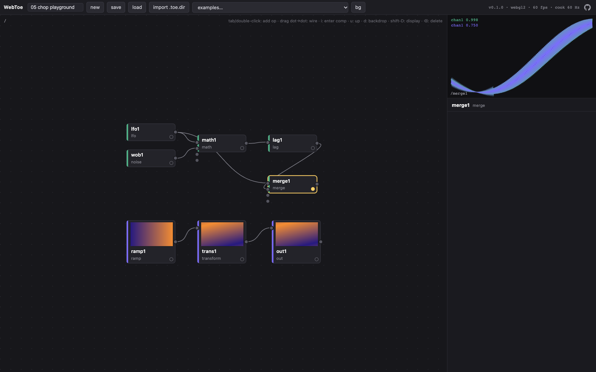
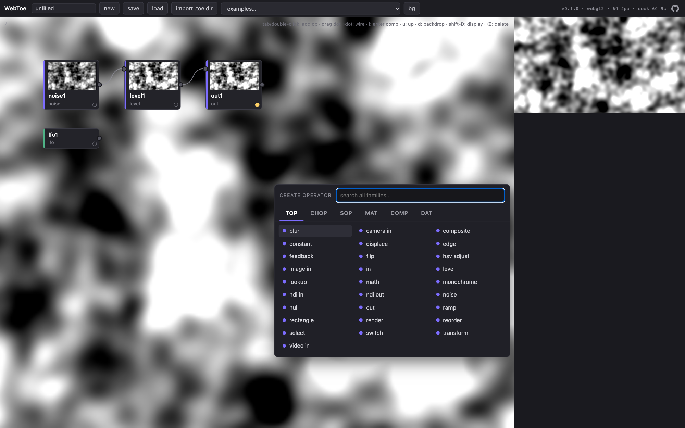
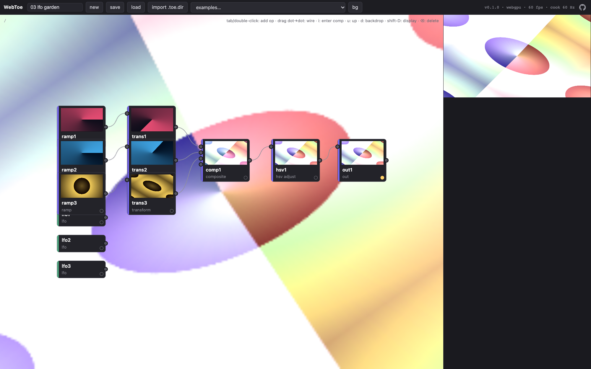
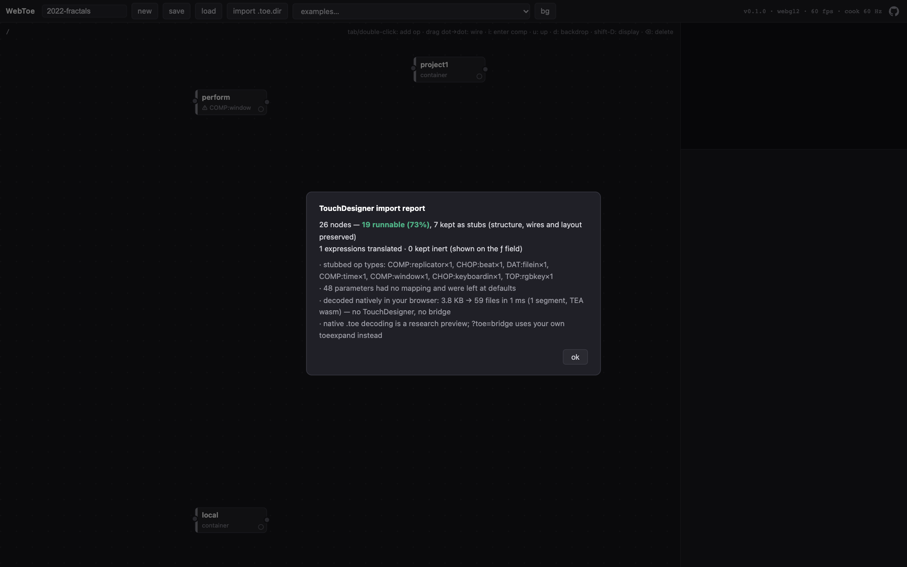

# WebToe

**A web-native, node-based dataflow engine for real-time visuals — patch operators together in the browser, TouchDesigner-style, and open your existing TouchDesigner projects.**

[](https://github.com/frank890417/WebToe/actions/workflows/ci.yml)
[](LICENSE)
[](https://webtoe.openaudiovisual.com/)
[](https://webtoe.openaudiovisual.com/docs/)

**▶ [Open the editor](https://webtoe.openaudiovisual.com/app/)** — no install, runs entirely in your browser · [Website](https://webtoe.openaudiovisual.com/) ([中文](https://webtoe.openaudiovisual.com/zh/)) · [Docs](https://webtoe.openaudiovisual.com/docs/) · [Open a raw `.toe` in the browser](https://webtoe.openaudiovisual.com/?project=examples/toe/2022-fractals.toe)



WebToe is an original engine and editor built from scratch for the web. It is not a TouchDesigner clone or port — it implements the workflow (operator families, wired networks, expression-driven parameters, a live cook loop) natively on **WebGL2 and WebGPU**, with **zero runtime dependencies** (the editor is about 260 KB of JavaScript, 76 KB gzipped). It cooks on **TouchDesigner's time model** — a fixed-rate cook clock — and it opens real TouchDesigner projects: a dropped `.toe` is decoded right in the browser (research preview), with your own TouchDesigner's `toeexpand` as the reference fallback.

## Highlights

- **Patch live in the browser** — network editor with a create-operator dialog (`Tab` / double-click: family tabs, searchable grid), wire dragging, container hierarchy with in/out tunneling, **real-time previews on every node** (one GPU compositor paints the viewer and all visible thumbnails), a TouchDesigner-style network backdrop, and a parameter panel with sliders, menus, and per-parameter **expressions** (`op('lfo1')['chan1']`, `parent().par.speed`, `time.seconds * 0.2`, …).
- **TouchDesigner's time model** — the engine cooks on a fixed grid at the project's cook rate (imported from the `.toe`, 60 Hz by default), so per-step constants such as feedback fades behave as they do in TouchDesigner on any display. State is deterministic (identical whether a frame runs 1, 7 or 24 steps), a 120 Hz display cooks a 60 Hz project 60 times a second, and a busy GPU never sends it into a catch-up death spiral.
- **TouchDesigner's numbers** — Level, Edge, Monochrome/Lookup, Ramp, Blur, Noise (Gustavson Perlin/simplex 2D–4D) and Composite (all 46 operations, premultiplied) follow formulas measured against TouchDesigner, with tested tolerances down to 1e-7.
- **Real-time GPU engine** — pull-based cook; TOPs run as GPU passes, CHOPs drive parameters; feedback with TouchDesigner's Target TOP semantics, a 3D pipeline (SOPs, MATs, geometry/camera/light COMPs, render TOP), webcam/video/image input, and NDI in/out.
- **Two GPU backends** — WebGL2 (default, universal) and WebGPU (`?backend=webgpu`), both speaking one backend-agnostic pass contract; the TOP shaders render identically on both within 1/255, and a contract test keeps the WGSL uniform layout in step with each operator.
- **Opens TouchDesigner projects** — drop a `.toe`/`.tox` and it is **decoded natively in the browser**, no TouchDesigner install needed (research use only — see below); supported operators run live, everything else becomes a faithful stub preserving names, wires, layout, parameters, and Python code, with an honest report. Validated byte for byte against `toeexpand` on 125 production projects.
- **Measured, reproducibly** — `npm run bench` prints one JSON line per project (fps, cook rate, fitted step cost, longest frame, heap growth, skipped steps); the editor's HUD shows display fps, cook rate and skipped steps live.
- **Own versioned format** — lossless `.webtoe.json` save/load with migration hooks; the cook rate travels with the project.

| Feedback trails (mouse-driven) | CHOP scope & channels |
|---|---|
|  |  |

| Operator palette | WebGPU backend |
|---|---|
|  |  |

## Opening TouchDesigner projects



**Drop a `.toe` on the page and it opens.** No install, no CLI step, no folder shuffling — the container is decoded right in your browser and the file never leaves your machine. [Try it with a raw 2022 project file](https://webtoe.openaudiovisual.com/?project=examples/toe/2022-fractals.toe) (saved by TouchDesigner 2021.16410); the report above is what it shows.

> **Native `.toe` decoding is provided for research purposes only.** It exists to study interoperability with project files you own, is not affiliated with or endorsed by Derivative Inc., and may break with any TouchDesigner release (Derivative has announced an official JSON project format; WebToe's `ProjectLoader` interface is ready for it). The bridge path below — your own TouchDesigner's `toeexpand` — stays the reference and the automatic fallback. Format notes and validation: **[docs/TOE-FORMAT.md](docs/TOE-FORMAT.md)** · [on the website](https://webtoe.openaudiovisual.com/docs/toe-format/).

**Measured in Chrome** (MacBook Pro, M4 Max): a 20 MB production show file decodes in **0.35 s** into 33,923 files, and the whole drop-to-running-graph takes **0.54 s** — 14,656 nodes, 71% runnable, 2,246 Python expressions translated. A 151 MB show file decodes in 1.8 s. Through the bridge, a comparable file took 8 s.

**Validated** against the official `toeexpand` (TouchDesigner 2025.33070) on **125 production project files** from 3 KB to 151 MB, saved by builds from 2021.16410 to 2025: identical file sets, byte for byte (553,230 files), in 17.7 s versus 266.5 s for `toeexpand`. Where TouchDesigner has sibling operators whose names differ only in case, the native decoder keeps both; `toeexpand`, writing to a case-insensitive disk, merges them.

**The reference path: your own TouchDesigner.** If native decoding fails, or you force it with `?toe=bridge`, the one step that needs TouchDesigner — the official `toeexpand` CLI, shipped with every TouchDesigner install — runs on your machine, through a small loopback service (`packages/bridge`). It binds to `127.0.0.1` only, has zero dependencies, and ships nothing of Derivative's: your project files never leave your computer.

```bash
npx webtoe        # serves the site and the editor locally with the bridge — then drag your .toe in
```

**No Node?** Every TouchDesigner install ships Python, so the same bridge is one stdlib-only file. Download [`bridge.py`](https://webtoe.openaudiovisual.com/bridge.py) (the guide dialog links it), then `python3 bridge.py` (TouchDesigner's bundled interpreter works too) and drop your `.toe` on the hosted page. Protocol-identical to `npx webtoe`.

```bash
# bridge only, for the hosted editor at webtoe.openaudiovisual.com/app/
npx webtoe --no-open

# share one bridge over LAN/Tailscale (e.g. TouchDesigner on a Windows box, browsing elsewhere)
npx webtoe --host 0.0.0.0 --token <secret>   # page: ?bridge=…&bridgeToken=<secret>

# no Node? expand by hand, then drop the resulting .toe.dir folder on the page
"/Applications/TouchDesigner.app/Contents/MacOS/toeexpand" myproject.toe

# batch/scripted conversion to a project file
node packages/cli/toe-convert.mjs myproject.toe        # → myproject.webtoe.json
```

What the importer recovers: node types and hierarchy, wires (including wires across COMP boundaries and in/out tunnels), parameter values, **live Python expressions** (translated to WebToe expressions where faithful — `absTime.seconds*0.2` → `time.seconds*0.2` — and kept inert otherwise), DAT text and Python source, network layout, and the project's cook rate. The parameter mode field is a bitfield decoded from production files (bit 0 = expression), so flagged expression modes import too.

### Tested, automatically

`.toe` reading is covered by a three-layer automated suite built on an **original committed fixture** — a real binary `.toe` plus its canonical `toeexpand` expansion, authored for this repo and round-tripped through the official tools ([provenance](tests/fixtures/README.md)):

1. a CI-safe layer asserts the full reconstructed graph — types, COMP-boundary and tunnel wires, parameter modes, translated expressions evaluated in the engine, honest stubs, report numbers, plus the sidecar container decoder;
2. the native decoder (CI-safe): the fixture decodes byte for byte to the committed expansion through both inflaters and imports to the identical graph; synthetic containers cover multi-segment archives, chunked kind-12 segments with records straddling chunks, chance segment magic in the ciphertext, and the recovery path;
3. an integration layer (auto-skipped where TouchDesigner isn't installed) expands the committed binary with the real `toeexpand` and runs the CLI and the bridge end-to-end — including a project whose filename is not English.

## TouchDesigner semantics

WebToe aims to behave like TouchDesigner where it matters for a ported network, not just look like it. Behaviour is taken from measurements against TouchDesigner made in the author's production web port of two TouchDesigner shows (2025–2026) and checked by tests here:

- **Cook clock** — a fixed-rate grid at the project cook rate (`packages/core/src/clock.ts`): step *k* is at *k* / rate seconds; the display shows the latest step. Catch-up uses a least-squares cost model over the last 16 frames (frame ≈ fixed cost + steps × step cost, 100 ms frame cap), and more than one second behind (a hidden tab, a stall) it skips ahead instead of replaying. `engine.advanceTo(t)` runs every step for offline work.
- **Feedback TOP** — the `top` parameter is TouchDesigner's Target TOP: the output is that TOP's result from the previous cook step, and the input passes through until it has rendered. Both GPU backends return the previous step whether or not the target has already rendered in this step (verified with a counter loop: 174 steps → 174/255).
- **Lag CHOP** — the lag time is the time to cover 90% of a step: *a* = 1 − exp(−dt·ln10 / lag).
- **Speed CHOP** — outputs the accumulation *before* this step; step 0 outputs 0.

- **TOP formulas** — measured against TouchDesigner and checked by CPU references, with the real shaders compared to those references in Chrome:

| TOP | What matches TouchDesigner | Measured tolerance |
|---|---|---|
| Level | order of operations, black level, ranges, low/high, post page; opacity scales RGB and alpha | ≤ 1e-3 |
| Edge | √strength, black level, offset, Rec.709 luminance, edge over input | ≤ 1.2e-7 |
| Monochrome, Lookup | Rec.709 luminance, channel menus | exact formula |
| Ramp | wrapping keys (up to 32), phase/period rules, extend, interpolation | median ≤ 1e-5 (antialias not reproduced) |
| Blur | full-width size, kernel integrated per texel, single-tap preshrink | ≤ 7.5e-7 |
| Noise | Gustavson Perlin/simplex 2D–4D, TouchDesigner's coordinates, seeds, octaves = harmon + 1 | ≤ 3.7e-3, 99.9% ≤ 6e-4 |
| Composite | premultiplied, all 46 operations, transform page | 37 ops ≤ 1e-7, 9 fitted ≤ 3e-5 |

The full table — including what is inferred or approximate, and how to capture TouchDesigner goldens with `tools/td-golden/capture.py` — is in [docs/TD-PARITY.md](docs/TD-PARITY.md).

## Performance

`npm run bench` (headless Chrome, MacBook Pro M4 Max) — every bundled project holds **60 fps with the cook clock at 60 Hz and zero skipped steps**. Measured directly (60 forced steps, then a synchronous readback), a cook step costs 0.25 ms for feedback trails, 0.50 ms for lfo garden, 0.73 ms for 3d lines and 0.84 ms for the showcase. What keeps it there:

- one cook per step, not per display frame (half the GPU work on a 120 Hz display);
- every node preview drawn by one GPU compositor;
- the network backdrop reads pixels back without stalling the pipeline (pixel-pack buffer + fence);
- no per-pass buffer allocation on WebGPU; both backends request the high-performance adapter;
- shader hot paths stay in registers (e.g. the ramp picks its keys with static indices — 4.7× faster than indexing a local array);
- TEA for the `.toe` container runs in a 287-byte WASM kernel (JS fallback), inflate is the platform's own.

## Operator set

81 operators, plus per-family stubs used by the importer:

| Family | Operators |
|---|---|
| TOP (28) | constant, noise, ramp, rectangle, transform, level, monochrome, hsv adjust, blur, composite, displace, lookup, edge, feedback, math, switch, select, reorder, flip, **render**, **ndi in/out** (via the local bridge), image in, video in, camera in, null, in, out |
| CHOP (14) | constant, lfo, noise, math (full TouchDesigner pipeline), lag, merge, select, switch, speed, parameter, mouse in, sop to, in, out |
| SOP (21) | line, circle, rectangle, grid, sphere, box, tube, torus, merge, transform, twist, noise, copy, skin, point, facet, add, switch, null, in, out |
| MAT (7) | constant, lit (phong/pbr), line, point sprite, wireframe, switch, null |
| COMP (5) | container, **geometry** (SOP networks, materials, SOP-point and CHOP-channel instancing), **camera** (look-at), **light**, **ambient light** |
| DAT (6) | text, table, select, null, in, out |

Expressions ship with `time`, `me`, `op()` channel access, `parent()`, `ext()` for external control, and a math library (`sin`, `clamp`, `fract`, `lerp`, `rand(seed)`, …). Reference: [operators](https://webtoe.openaudiovisual.com/docs/operators/) · [expressions](https://webtoe.openaudiovisual.com/docs/expressions/).

## Examples

Twelve bundled projects load from the editor's toolbar and run out of the box ([examples page](https://webtoe.openaudiovisual.com/docs/examples/)). The flagship is **09 showcase** — 27 nodes exercising every family at once: a webcam layer through edge detection, a kaleidoscope COMP with in/out tunnels, a mouse-position source switch, noise displacement, hue-drifting feedback trails, and a full CHOP rig (lag, speed integrator, parameter reader, full math pipeline) driving it through eight live expressions. **10 3d lines** runs the full 3D pipeline: skinned line ribbons and noise-scattered instanced spheres inside geometry COMPs, an orbiting look-at camera, lights, a render TOP, and a glow post chain. Five authored 2D patches — **hello noise**, **feedback trails** (move your mouse over the viewer), **lfo garden**, **webcam displace**, **chop playground** — and three **2022 TouchDesigner daily sketches imported through the `.toe` pipeline** (pseudo-voronoi, fractal feedback, a mouse-interactive CHOP study; lightly adapted for the web). **11** and **12** are the raw `.toe` files of two of those sketches, saved by TouchDesigner 2021.16410 and decoded natively the moment you pick them.

## Documentation

The website carries the full docs in English and Chinese: [getting started](https://webtoe.openaudiovisual.com/docs/getting-started/) · [examples](https://webtoe.openaudiovisual.com/docs/examples/) · [importing TouchDesigner projects](https://webtoe.openaudiovisual.com/docs/importing/) · [the .toe format](https://webtoe.openaudiovisual.com/docs/toe-format/) · [operators](https://webtoe.openaudiovisual.com/docs/operators/) · [expressions](https://webtoe.openaudiovisual.com/docs/expressions/) · [embedding & external control](https://webtoe.openaudiovisual.com/docs/embedding/) · [NDI](https://webtoe.openaudiovisual.com/docs/ndi/) · [architecture](https://webtoe.openaudiovisual.com/docs/architecture/) · [TouchDesigner parity](https://webtoe.openaudiovisual.com/docs/td-parity/). The docs sources live in [`site/docs/`](site/docs/).

## Quick start (development)

```bash
npm install
npm run dev        # editor at http://localhost:8643/app/
npm run check      # typecheck + 208 tests (GPU and TouchDesigner-golden checks run when their env vars are set)
npm run build      # site + editor → apps/web/dist (/, /zh/, /docs/, /app/)
npm run site       # site only; npm run site:check guards against drift
npm run bench      # runtime numbers in headless Chrome (needs the dev server)
node tools/capture-screens.mjs   # regenerate the README screenshots (needs the dev server + Chrome)
```

## Architecture

npm workspaces with a strict downward dependency rule — `apps/web → editor → {ops, gpu, io} → core`, where `core` imports nothing:

| Package | Role |
|---|---|
| `@webtoe/core` | graph model, pull-based cook engine on the fixed-rate cook clock, expression system, backend-agnostic GPU pass contract, versioned serialization, public `registerOp` plugin API |
| `@webtoe/ops` | operator definitions; CHOP kernels behind a WASM-ready interface; TOP shaders authored per backend (GLSL **and** WGSL, hand-written) |
| `@webtoe/gpu` | WebGL2 backend + WebGPU backend, texture pools, step-aware ping-pong feedback, non-blocking readback |
| `@webtoe/io` | `.webtoe.json`, the native `.toe` container decoder (research use only), and the expansion importer behind a `ProjectLoader` adapter (Derivative's announced official JSON format slots in beside it) |
| `@webtoe/editor` | embeddable, framework-free editor — `mountEditor(el, opts)` |
| `@webtoe/cli` | `toe-convert.mjs` |
| `webtoe-bridge` | loopback service: serves the site and the editor and runs your own `toeexpand` |
| `tools/site` | dependency-free generator for the website and docs (`npm run site`) |

Deep dives: [docs/ARCHITECTURE.md](docs/ARCHITECTURE.md) · execution contract & milestones: [PLAN.md](PLAN.md) · build log: [WORKLOG.md](WORKLOG.md) · research foundation (file-format findings, feasibility, sources): [docs/RESEARCH.md](docs/RESEARCH.md)

## Roadmap — measured against real work

To define "complete", we analyzed **60 real TouchDesigner projects (28,698 nodes, 2022–2026)** from a daily-practice generative art portfolio and crawled the **official operator inventory (~675 operators across 7 families)**. Two documents drive the evolution: **[docs/ROADMAP.md](docs/ROADMAP.md)** (phased plan with measured results — corpus coverage: 32.3% → 47.1% → **62.3%** across two measured evolution cycles, the second being the full 3D pipeline) and **[docs/TD-PARITY.md](docs/TD-PARITY.md)** (the full parity charter: per-family op tiers, portable vs web-equivalent vs native-only classification, and the engine-concept gaps — time slicing, audio, 3D, GLSL, POPs, panels — with the standing measure → pick → implement → verify loop).

## Sister project: open-audiovisual

[**open-audiovisual**](https://github.com/frank890417/open-audiovisual) is a web-native framework for audiovisual *performance* — MIDI/chord/pose inputs, a signal-to-parameter mapping layer, a timeline with scenes and cues, and a backstage monitor. The two are halves of one stack: **WebToe is the engine, open-audiovisual is the show.** Its `world-webtoe` adapter embeds the editor and drives patch expressions through `ext()`, and openav's named signals map naturally onto CHOP channels. Site: [openaudiovisual.com](https://openaudiovisual.com) · [the WebToe page there](https://openaudiovisual.com/webtoe/).

## NDI In/Out

Browsers can't join NDI networks directly, so WebToe pairs two pieces: a tiny local bridge (`packages/ndi-bridge`, WebSocket on localhost) that owns the NDI side with **your own NDI runtime**, and `ndi in`/`ndi out` TOPs that do the pixel work in the browser — UYVY⇄RGBA conversion runs in a **1 KB WASM kernel** (AssemblyScript source in `packages/wasm-kernels`, JS fallback always available). Try it with zero NDI dependencies: `node packages/ndi-bridge/index.mjs --mock` streams an animated test pattern; for real NDI install the NDI runtime plus `grandiose` in the bridge package. NDI® is a trademark of Vizrt NDI AB — this repo ships no NDI SDK bits.

## For contributors and future agents

[docs/HANDOFF.md](docs/HANDOFF.md) is the complete project log: every experiment with its verdict, the architecture invariants, a catalog of hard-won gotchas, the measured evolution curve, and the standing order of upcoming work with design head-starts.

## Disclaimer

WebToe is an independent open-source project, **not affiliated with or endorsed by Derivative Inc.** TouchDesigner is a trademark of Derivative Inc. WebToe contains no Derivative code, binaries, or assets. It opens project files for interoperability: either by decoding the container natively — **provided for research purposes only** ([docs/TOE-FORMAT.md](docs/TOE-FORMAT.md)) — or from the text expansion users generate locally with their own licensed TouchDesigner installation. All engine code, shaders, and UI design in this repository are original work.

## License

[MIT](LICENSE) · third-party notices for the noise and other shader algorithms: [THIRD_PARTY_NOTICES.md](THIRD_PARTY_NOTICES.md)
